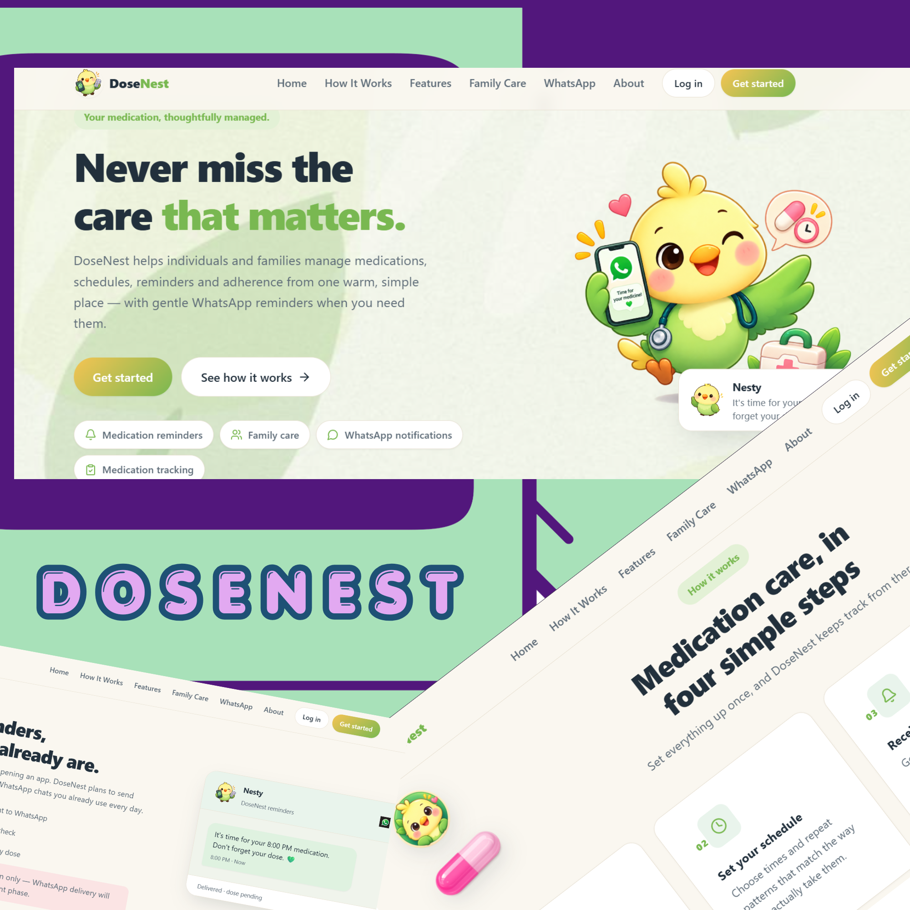

# DoseNest

<div align="center">
  
</div>

**Your medication companion for you and your family.**

DoseNest is an original family medication management platform. It helps you manage your own
medications and the ones you look after — for parents, grandparents, children, and other family
members — with clear schedules, gentle reminders, and an honest record of what was taken, skipped,
or snoozed.

Built as a modern, friendly healthcare/family-care MERN application with a soft yellow & green
bird mascot as its brand identity

> DoseNest is **not** a medical device, diagnostic tool, or advice platform. It helps organize the
> medications you and your family already take. This is an original product, not affiliated with or
> copied from any existing medication reminder service.

## Key Features

- Manage medications for yourself and your family (Family Care Mode).
- Create medication schedules with repeat rules.
- Track doses as taken, skipped, or snoozed.
- Medication history and adherence monitoring.
- Prescription management (upload + future AI extraction with explicit user confirmation).
- Opt-in WhatsApp medication reminders (Meta WhatsApp Cloud API — Phase 7).

**Status note:** the repository currently contains the project foundation. See
[MVP.md](./MVP.md) for an honest, up-to-date list of what is implemented vs. planned.

## Tech Stack

| Layer       | Tech                                                        |
| ----------- | ------------------------------------------------------------ |
| Frontend    | React 18, Vite 6, JavaScript, React Router 7, Axios, CSS     |
| Icons       | Lucide React                                                 |
| Motion      | Framer Motion (used sparingly)                               |
| Backend     | Node.js, Express 4, JavaScript, MongoDB + Mongoose 8         |
| Auth        | JWT (httpOnly cookie), bcryptjs — implemented (Phase 3)       |
| Security    | helmet, cors (credentials), express-rate-limit, dotenv       |
| Tooling     | ESLint 9 (flat config), Prettier, Nodemon, npm workspaces    |

## Project Architecture

```
dose-nest/
├── client/            React + Vite frontend
│   ├── public/assets/ bird.jpeg mascot (add here)
│   └── src/
│       ├── components/  brand, common, layout
│       ├── layouts/
│       ├── pages/
│       ├── routes/
│       ├── services/    centralized axios client
│       ├── store/       (placeholder)
│       ├── hooks/
│       ├── utils/
│       └── styles/      design tokens + global css
├── server/            Express + Mongoose API
│   ├── config/        db connection
│   ├── controllers/
│   ├── middleware/    auth (placeholder), notFound, errorHandler
│   ├── models/        User, FamilyMember, Medication, MedicationSchedule,
│   │                  MedicationLog, Prescription, Notification
│   ├── routes/        /api/health implemented
│   ├── services/      (placeholder)
│   ├── jobs/          (placeholder)
│   ├── utils/         AppError
│   └── validators/    (placeholder)
├── docs/
├── MVP.md             living project source of truth
└── package.json       npm workspaces + combined scripts
```

## Installation

Requirements: Node.js 18+ and MongoDB running locally (or a remote `MONGODB_URI`).

```bash
# 1. Install all workspace dependencies
npm install

# 2. Configure environment variables
copy server\.env.example server\.env
# then edit server\.env with your MONGODB_URI and a strong JWT_SECRET
```

## Environment Variables

| Variable       | Description                                    | Example                              |
| -------------- | ---------------------------------------------- | ------------------------------------ |
| `NODE_ENV`     | Runtime environment                            | `development`                        |
| `PORT`         | API server port                                | `5000`                               |
| `MONGODB_URI`  | MongoDB connection string                      | `mongodb://127.0.0.1:27017/dosenest` |
| `JWT_SECRET`   | Secret used to sign JWTs (long random value)   | `generate_a_long_random_value`       |
| `JWT_ACCESS_TOKEN_EXPIRES_IN` | Access-token lifetime (finite session expiry) | `7d`                     |
| `JWT_EXPIRES_IN` | Legacy alias for the token lifetime           | `7d`                                 |
| `SESSION_IDLE_TIMEOUT_MINUTES` | Client-side inactivity guard (0 disables) | `60`                       |
| `CLIENT_URL`   | Allowed frontend origin for CORS credentials   | `http://localhost:5173`              |
| `WHATSAPP_ENABLED` | Master switch for WhatsApp delivery (default `false`) | `false`                     |
| `WHATSAPP_TEST_MODE` | Simulate sends locally without credentials   | `false`                      |
| `WHATSAPP_ACCESS_TOKEN` | Meta Cloud API access token (never commit) | *(from Meta)*              |
| `WHATSAPP_PHONE_NUMBER_ID` | Business phone number ID (never commit)  | *(from Meta)*              |
| `WHATSAPP_BUSINESS_ACCOUNT_ID` | Optional — not required for sending | *(from Meta)*              |
| `WHATSAPP_API_VERSION` | Graph API version used for messages        | `v21.0`                              |
| `WHATSAPP_MAX_RETRIES` | Retries for transient provider failures   | `2`                                  |
| `WHATSAPP_RETRY_DELAY_MS` | Delay between retries                 | `2000`                               |
| `WHATSAPP_REQUEST_TIMEOUT_MS` | Per-request timeout                | `10000`                              |
| `WHATSAPP_TEMPLATE_LANGUAGE` | Template language code (Cloud API)   | `en`                                 |
| `WHATSAPP_TEMPLATE_MEDICATION_DUE` | Approved template name            | `medication_due_reminder`            |
| `WHATSAPP_TEMPLATE_MEDICATION_MISSED` | Approved template name          | `medication_missed_reminder`         |
| `WHATSAPP_TEMPLATE_MEDICATION_TAKEN` | Approved template name            | `medication_taken_confirmation`      |
| `WHATSAPP_TEMPLATE_REMINDER` | Approved template name                | `medication_upcoming_reminder`       |
| `WHATSAPP_WEBHOOK_VERIFY_TOKEN` | Token echoed during Meta's webhook subscription handshake | `random_value`       |
| `WHATSAPP_APP_SECRET` | Optional — enables X-Hub-Signature-256 webhook verification | *(from Meta)*       |
| `WHATSAPP_TAKEN_CONFIRMATION_WINDOW_MINUTES` | How long a `TAKEN` reply is accepted | `90`                |

`.env` files are git-ignored. Never commit real secrets. Full placeholder list:
`server/.env.example`.

## WhatsApp Integration (Phases 7, 8 & 9)

DoseNest delivers medication reminders over WhatsApp using the **official Meta WhatsApp
Cloud API** (Graph API). The Phase 6 notification engine remains the source of truth — WhatsApp is
just a delivery channel layered on top. Phase 8 adds webhooks (delivery status updates + the
**TAKEN** reply flow); Phase 9 completes real-delivery readiness.

**Full developer guide: [`docs/WHATSAPP_SETUP.md`](docs/WHATSAPP_SETUP.md)** — Meta app setup,
credentials, approved-template contracts, webhook configuration, local webhook testing, and the
complete testing checklist.

**Safety:** with `WHATSAPP_TEST_MODE=true` every send is simulated — real messages are never sent
while test mode is enabled, even if credentials are present. Real delivery requires
`WHATSAPP_ENABLED=true` + credentials + approved templates. TAKEN replies also accept **YES** and
**DONE** as aliases.

### How it works

```
Reminder engine → Notification (MongoDB) → WhatsApp delivery service → WhatsApp service → Cloud API
```

When the reminder engine creates a `medication_due`, `medication_missed`, `medication_taken`, or
`reminder` notification, the delivery pipeline checks that WhatsApp is enabled, configured, the user
has opted in with a valid E.164 phone number, then sends and records the result (status,
`providerMessageId`, attempts) on the same notification. Delivery is **idempotent** (a notification
is never sent twice) and never blocks or breaks the reminder engine.

### Setup requirements

1. **Create a WhatsApp Business Account** at the Meta developer portal
   (https://developers.facebook.com) and register a business phone number.
2. **Create an app** and enable the WhatsApp product to get an access token and phone number ID.
3. **Create and submit message templates** (see below).
4. **Configure `server/.env`** with the credentials — never commit them.
5. **Enable delivery**: set `WHATSAPP_ENABLED=true`.
6. Users opt in from **Settings → WhatsApp Medication Reminders**: add their phone number (E.164,
   e.g. `+15551234567`) and toggle **"Accept WhatsApp medication reminders"** on. Consent is
   explicit — a phone number alone never enables delivery, and the toggle stays OFF by default.
   Reminders are only ever sent to the account owner's own number.

### Template requirements

Business-initiated WhatsApp messages require **pre-approved templates** created in the WABA console.
DoseNest expects the following templates (names are configurable via env; language default `en`):

| Template name (default)            | Parameters                                                                  |
| ---------------------------------- | --------------------------------------------------------------------------- |
| `medication_due_reminder`          | `{{1}}` first name, `{{2}}` subject, `{{3}}` time                           |
| `medication_missed_reminder`       | `{{1}}` first name, `{{2}}` subject, `{{3}}` time                           |
| `medication_taken_confirmation`    | `{{1}}` first name, `{{2}}` subject                                         |
| `medication_upcoming_reminder`     | `{{1}}` first name, `{{2}}` subject, `{{3}}` time                           |

`subject` is a privacy-conscious summary like "Metformin (500 mg)" or "Mom's Metformin (500 mg)".

### Local test mode

For development, WhatsApp is **disabled by default** (`WHATSAPP_ENABLED=false`) — reminders still work
in-app and no provider request is ever attempted. To exercise the delivery pipeline safely:

```bash
WHATSAPP_TEST_MODE=true
```

With test mode on and no credentials, messages are **simulated locally** and clearly marked
(`simulated: true`; the UI shows "WhatsApp: Simulated (test mode)"). Simulation never pretends a real
message was delivered.

### Testing safely

- **Disabled first**: confirm reminders and notifications still work with `WHATSAPP_ENABLED=false`
  (no WhatsApp traffic).
- **Then test mode**: enable `WHATSAPP_TEST_MODE=true` and use **Settings → Send test message**
  (authenticated; only ever sends to your own number).
- **Only then real delivery**: add real credentials and approved templates, then send a test message
  to your own verified number before enabling end-to-end reminder delivery.
- Never accept arbitrary recipient numbers from any endpoint.

### Webhooks (Phase 8)

**Routes** (public on purpose — Meta calls them without a DoseNest session; security comes from
verification, not JWT):

| Route | Purpose |
| ----- | ------- |
| `GET /api/webhooks/whatsapp` | Meta subscription handshake (`hub.mode=subscribe`, `hub.verify_token`, `hub.challenge`) — echoes the challenge when the token matches `WHATSAPP_WEBHOOK_VERIFY_TOKEN`. |
| `POST /api/webhooks/whatsapp` | Delivery status (`sent`/`delivered`/`read`/`failed`) and incoming messages (`TAKEN`). |

### Delivery status behavior

Status events are matched to the existing Notification by `providerMessageId` and update it in
place — the Phase 7 notification record is preserved, never duplicated. The notification UI shows
the resulting state (Sent / Delivered / Read / Failed), plus **Simulated** for test-mode sends.

### TAKEN command

Users can reply to a reminder with **TAKEN** (case-insensitive, whitespace-tolerant) to confirm the
dose. Flow: sender phone → verified DoseNest account → opt-in check → most recent eligible dose
within `WHATSAPP_TAKEN_CONFIRMATION_WINDOW_MINUTES` → MedicationLog marked taken → adherence updates
naturally → confirmation reply sent. Webhook deliveries are deduplicated (provider event/message IDs)
so the same TAKEN can never mark a dose twice or resend confirmations.

### Multiple-dose behavior

If several eligible doses exist at once, DoseNest does **not** guess — it replies asking for the
medication name, and `TAKEN <medication name>` matches against your real medication records.
Ambiguous or unmatched names get a clarification reply.

### Webhook verification & security

- GET handshake: challenge echoed only when `hub.verify_token` equals `WHATSAPP_WEBHOOK_VERIFY_TOKEN`.
- POST verification: set `WHATSAPP_APP_SECRET` to require a valid `X-Hub-Signature-256` HMAC over the
  raw body (recommended for real delivery; optional locally).
- Sender identity comes only from the verified WhatsApp phone number linked to the account — body
  `userId`/`notificationId`/`medicationId` values are never trusted.
- TAKEN is ignored for unknown senders (masked log, nothing modified/revealed) and for users with
  WhatsApp reminders disabled.
- No real provider request is ever made in test mode.

### Local webhook testing

localhost cannot receive Meta webhooks directly. With `WHATSAPP_TEST_MODE=true`, use the protected
endpoint **`POST /api/notifications/whatsapp/simulate-webhook`** (authenticated) to feed fabricated
events — `sent`, `delivered`, `read`, `failed`, or `taken` — through the **same** webhook processing
service real Meta events use. Delivery-status simulation only references your own notifications.

## Future Integrations (Planned, Not Implemented)

- Scheduled reminder jobs beyond the current in-process interval job.
- Prescription upload with AI/OCR extraction — users always review and confirm before data is saved.
- Medication adherence analytics and insights.
- Predictive adherence insights / recommendation engine.
- Cloud image storage.
- Email notifications.

## Development Commands

Run everything from the project root:

| Command              | What it does                                          |
| -------------------- | ----------------------------------------------------- |
| `npm run dev`        | Start server (nodemon, :5000) and client (Vite, :5173) together |
| `npm run dev:server` | Start backend only                                    |
| `npm run dev:client` | Start frontend only                                   |
| `npm run build`      | Production build of the client                        |
| `npm run lint`       | Lint client and server                                |
| `npm run format`     | Prettier format client and server                     |
| `npm start`          | Run the API server in production mode                 |

The Vite dev server proxies `/api` requests to `http://localhost:5000`.

Health check: `GET http://localhost:5000/api/health`

## Session Management (Phase 6.5)

- **Finite sessions**: access tokens expire per `JWT_ACCESS_TOKEN_EXPIRES_IN` (default 7d); the
  httpOnly cookie's lifetime stays aligned. There is no "forever" session.
- **Secure storage**: the JWT lives only in an httpOnly, SameSite=Lax (Secure in production)
  cookie. The frontend cannot read it; nothing is stored in localStorage.
- **Refresh restore**: on every page load the app validates the session via `GET /api/auth/me`
  (which also returns the non-secret idle-timeout config) — never trust stale frontend state.
- **Expiry while active**: any non-auth 401 is handled centrally by the axios client — auth state
  is cleared, the user is redirected to `/login`, and a friendly "Your session has expired. Please
  log in again." message is shown once (no loops).
- **Idle timeout**: `SESSION_IDLE_TIMEOUT_MINUTES` (default 60) arms a client-side inactivity
  guard that resets on real interaction (pointer/keyboard/touch/wheel) and logs out after genuine
  idle time. The JWT remains the hard server-side expiry; the architecture is a soft client guard
  because sessions are stateless JWTs.
- **Logout**: clears the cookie and client state; protected routes and the backend both keep
  enforcing authentication afterwards.
- **Login throttling**: login/register are rate-limited per IP (20 attempts / 15 min) on top of
  the global `/api` limiter.

## Security Notes

- No hardcoded secrets; everything comes from environment variables.
- WhatsApp credentials live **only** in `server/.env` — never in React code, never exposed by any
  API response, never logged (recipients are masked in logs; tokens and authorization headers are
  never logged).
- Global API rate limiting (`express-rate-limit`) applied to `/api`.
- helmet sets secure HTTP headers; CORS restricted to `CLIENT_URL` with credentials.
- Passwords hashed with bcryptjs (cost 12); tokens signed with JWT and stored in an httpOnly
  cookie (SameSite=Lax, Secure in production).
- Credentials never live in client-side code or storage; the auth state is restored via
  `GET /api/auth/me` on startup.
- The WhatsApp test endpoint only ever sends to the authenticated user's own number — it cannot be
  used as an open sender.

## Future Deployment

Not deployed yet. Planned approach:

- Build client with `npm run build` and serve via a static host or the Express app.
- Host MongoDB (Atlas) and configure `MONGODB_URI` as an environment variable on the host.
- Set `NODE_ENV=production` and a strong `JWT_SECRET`.
- Point `CLIENT_URL` at the real frontend domain.
- CI (lint + build + tests) and containerization can be added later.

## Recommended VS Code Extensions

- **ESLint** (`dbaeumer.vscode-eslint`) — catch issues as you type.
- **Prettier** (`esbenp.prettier-vscode`) — consistent formatting.
- **ES7+ React/Redux/JS snippets** (`dsznajder.es7-react-js-snippets`) — React snippets.
- **MongoDB for VS Code** (`mongodb.mongodb-vscode`) — inspect the local DB.
- **GitLens** (`eamodio.gitlens`) — richer git history and blame.

Use the included `.prettierrc` as your formatter config. Pair formatting with your editor's
"Format on Save" for best results.

## License

Not licensed yet. Proprietary/portfolio project — reach out before reusing.
